# По тропе, посвящённой Cубботнему Дню

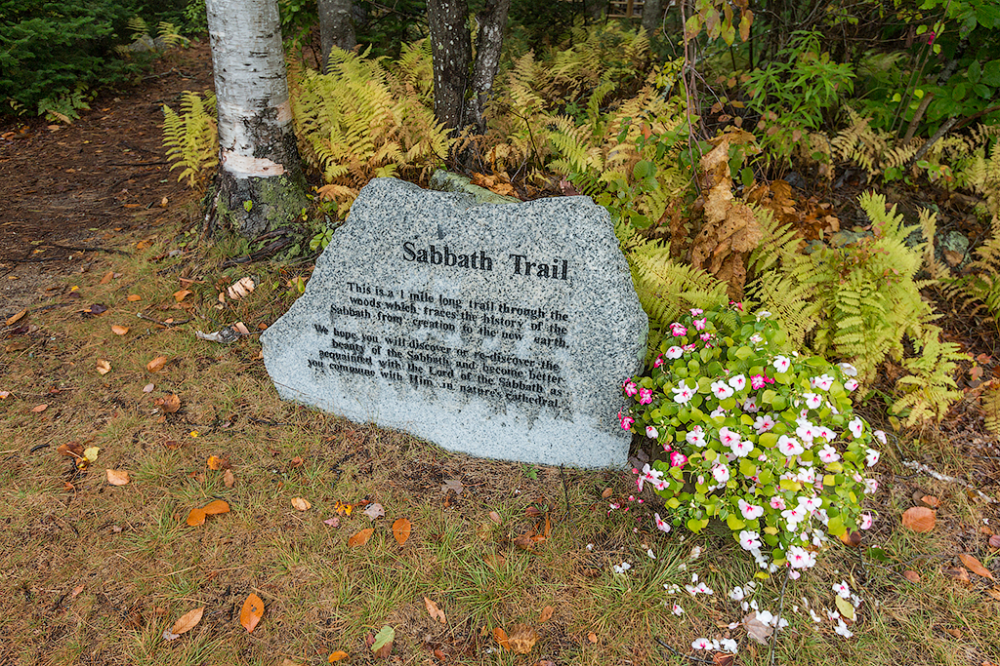

Тропа рассказывает об истории Субботнего Дня – от появления Дня Субботнего до сотворения Новой Земли. Эта история, высеченная в граните, стала Мемориалом Дню Отдохновения Господнего. И это очень, очень хорошая идея. Пройдите по всей тропе или прочитайте всю историю прямо здесь. Мемориал наглядно и убедительно объясняет, почему мы должны по-настоящему соблюдать Субботний День Отдохновения.
Уникальная тропа длиной в одну милю расположена в лесах, прилегающих к территории Вашингтонской Церкви адвентистов седьмого дня в штате Нью-Гэмпшир, и была открыта 12 сентября 1998 года.

1. **В идеальном мире отдыхал Бог в день субботний, который благословил и освятил.**
  В начале сотворил Бог небо и землю … И совершил Бог к седьмому дню дела Свои, которые Он делал, и почил в день седьмый от всех дел Своих, которые делал. И благословил Бог седьмой день, и освятил его, ибо в оный почил от всех дел Своих, которые Бог творил и созидал. Бытие 1:1; 2:2-3.
  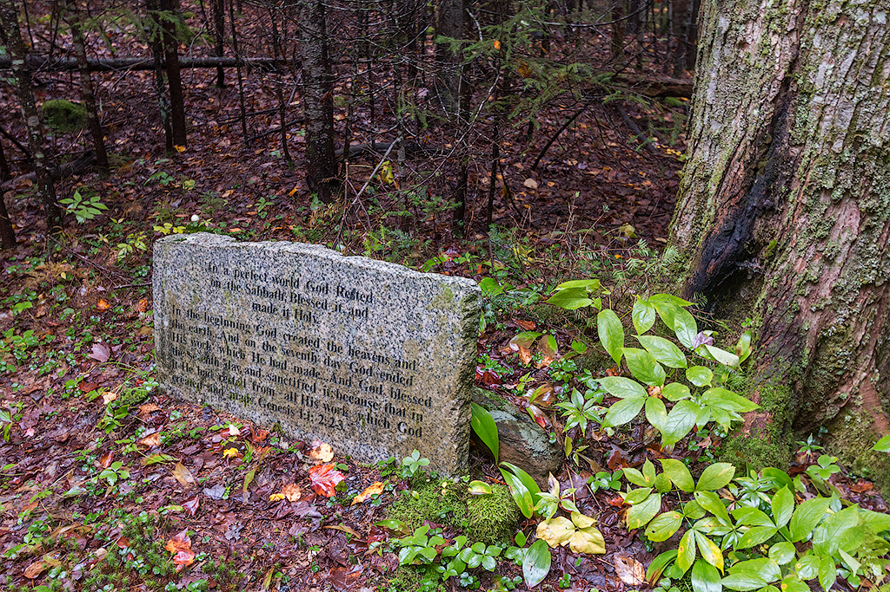

2. **День субботний – Рай во время Исхода**
  Божьи люди соблюдали День субботний, пока не были угнаны в Египет. Во время рабства в Египте хозяева принуждали их нарушать День субботний. Большинство из них забыли о его святости. К возрождению Дня субботнего привело обвинение людей Фараоном, что они «отдыхали» в субботу…
  … Бог сказал: «Помните День субботний, установленный Мною,
  … потому что многие забыли о нём». Исход 5:1-5; 20:8
  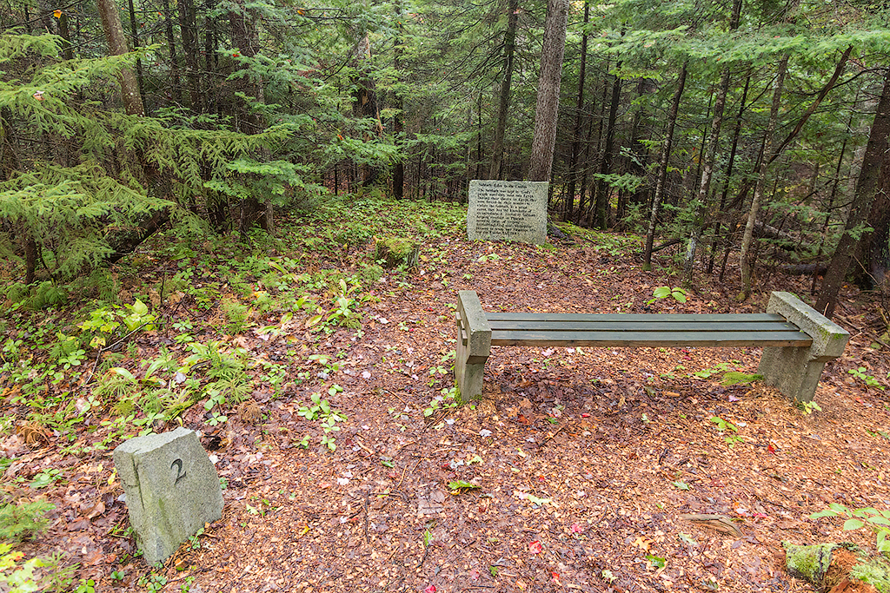

3. **День субботний - от Исхода до горы Синай**
  Когда люди Бога шли к горе Синай, Бог давал им в пропитание манну небесную. Шесть дней в неделю Бог ниспосылал еду, но не в 7-й день. Это чудо укрепляло возрождение Дня субботнего, способствовало его соблюдению. Некоторые, однако, не поверили Богу и вышли собирать еду в День субботний. Но, любя детей своих, Господь упрекнул их, спросив «Долго ли будете вы уклоняться от соблюдения заповедей Моих и законов Моих?» И покоился народ в седьмой день. Исход 16:21-30.

4. **На горе Синай – Десять Заповедей**
  На горе Синай. Бог сначала напомнил своим людям об их особых отношениях с Ним и о том, что Он спас их. Затем Он дал им десять заповедей, которые перечисляли законы Его правления и описывали Его характер. И просил Он своих людей жить по этим законам. Исход 20:1-17.
  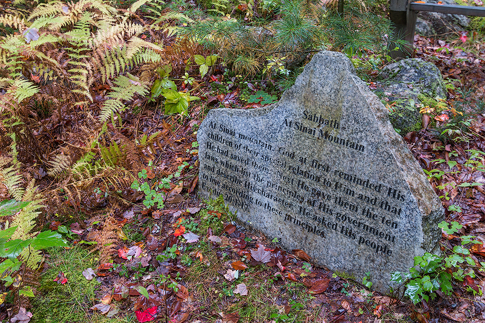

5. **Песнь на день субботний. Псалом 92.**
  Идеальный Бог желает, чтобы Его люди соблюдали День субботний как описывал царь Давид, кающийся грешник, “тех же взглядов, что и Бог”. Эта Песнь на день субботний доказывает борьбу Бога против ложных обвинений сатаны. Она объявляет День субботний днём абсолютной радости; днём обожания нашего Создателя, днём наслаждения в Его спасительной любви; днём признания Его священной силы; днём ожидания наивысшего блаженства рядом с Ним. Первая книга Царств, 13:14, Псалом 92.
  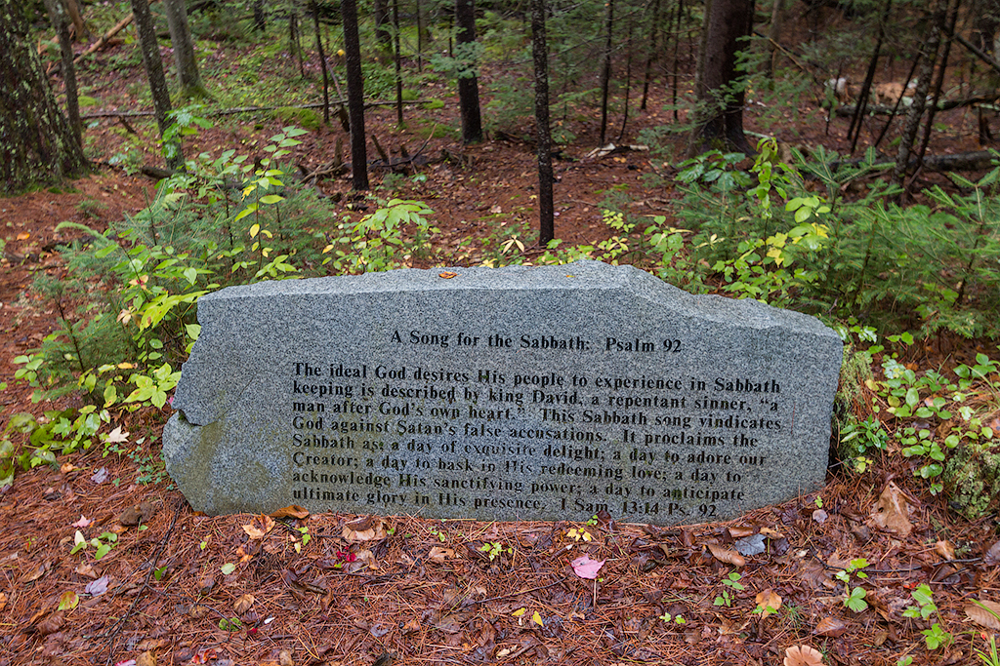

6. **Отход от соблюдения Дня субботнего - Времена царей.**
  В течение следующих нескольких веков поведение людей Бога и их отношение к соблюдению Дня субботнего являлось точным индикатором их связи с Богом. Обычно нация следует примеру своего лидера … люди либо идут рядом с Богом, либо впадают в идолопоклонство и язычество.
  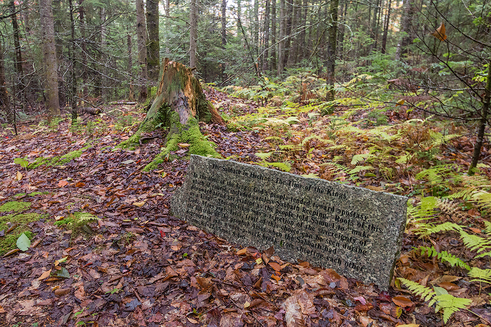

7. **Попранный День Субботний.**
  Предупреждения пророков о предательстве Его заветов и о нарушении Субботы были отвергнуты, и вот 10 племен попали в плен. Прошли годы, но оставшиеся на свободе племена проигнорировали такие же предупреждения, попрали и осквернили Субботу, стали работать в этот день. Бог хотел, чтобы люди оценили Его по заслугам, почитали Его, радовались в День отдохновения и свято соблюдали его. Но те отвергли полновластие Бога, выбрали для себя неволю..., позволили другим управлять собой. Даже после возвращения из плена Субботний День был восстановлен только благодаря жёстким мерам Неемии. Исаия 56 и 58, Иеремия 17:19-27, Неемия 13:14-21
  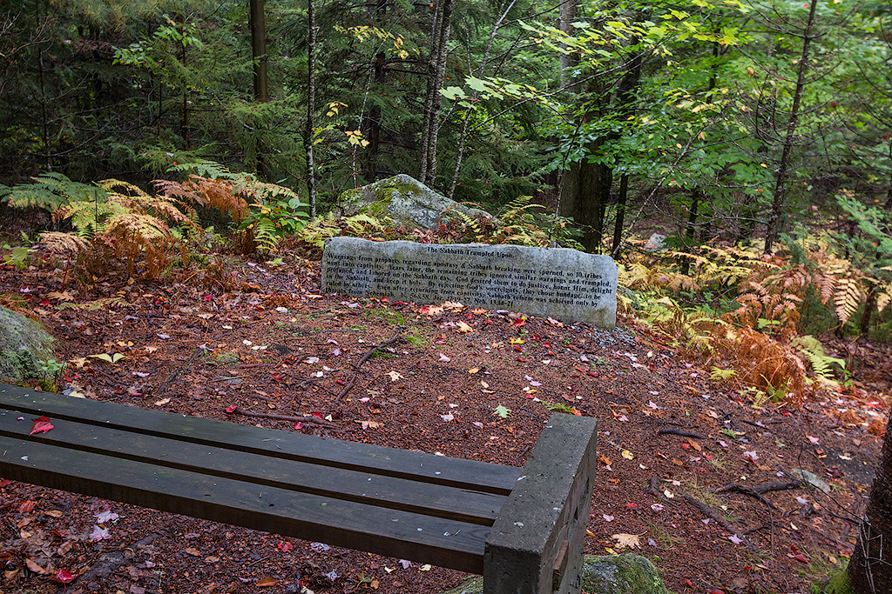

8. **День Субботний. Неемия - Иисусу.**
  В течение следующих 450 лет отношение к соблюдению Дня отдохновения колебалось от небрежного до жёсткого, от пренебрежительного до возвеличивающего. Сотни законов объясняли, что можно делать и что нельзя, чтобы не нарушать Субботу. В результате для людей соблюдение всех правил стало весьма обременительным и только внешним ритуалом, формальным способом получения репутации праведника. В конце этого тёмного периода времени Христос начал Своё земное служение. Больше 3 лет Он трудился, чтобы исправить искажённое представление людей о Боге и установленном Им особенном дне – дне отдыха. Святое Евангелие от Матфея 12:10-14 и 23, Послание к Римлянам 10:1-4
  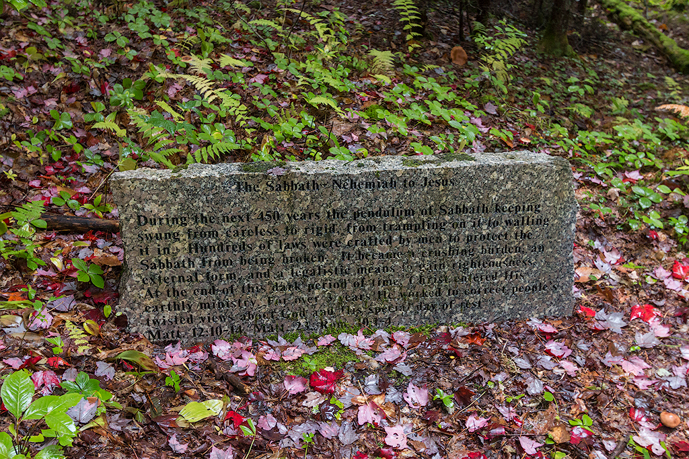

9. **Восстановление Субботнего Дня.**
  Как-то раз в Субботу в самом начале своего служения Иисус вошел в синагогу, «поскольку это был Его обычай», и объявил, что Он выполнил мессианское пророчество Исайи. Так День Субботний оказался связанным с миссией Христа проповедовать Евангелие, излечивать разбитые сердца, спасать пленных и открывать слепым глазам. Следуя своему плану, Он целенаправленно и последовательно начал восстанавливать День отдыха в соответствии с первоначальным замыслом Бога. Исаия 58, 61, Святое Евангелие от Луки 4:16-21
  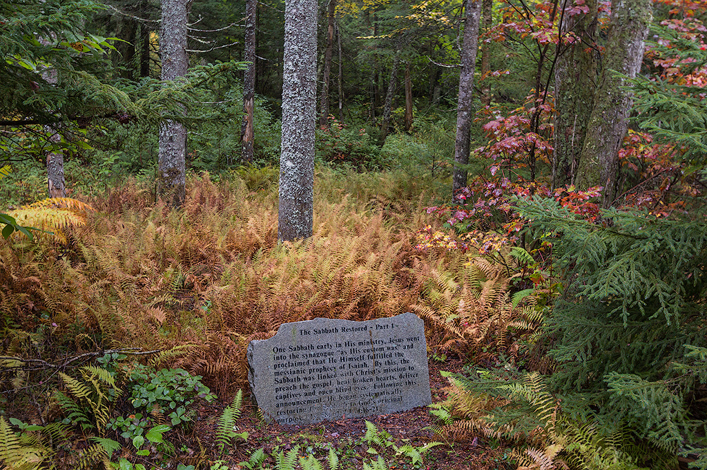

10. Чудо исцеления Иисусом человека у купальни прославило имя Бога, как и День Субботний. Любовь Бога, проявляющаяся в Его постоянной заботе о том, чтобы поднимать и исцелять свои создания, была продемонстрирована поступком Христа. Иисус показал, что истинное соблюдение Субботы, на самом деле, включает в себя искупление, исцеление, облегчение страданий и наделение людей здоровьем и благополучием. Христос начал процесс очищения Дня Субботнего от обременительных искусственных правил. Святое Евангелие от Иоанна 5:1-47.
  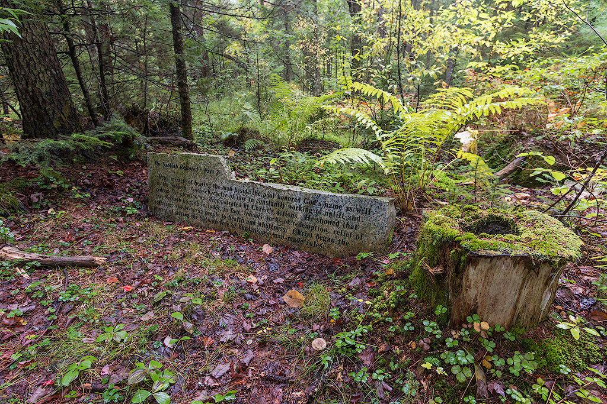

11. Своей Божественной волей Иисус изгнал демона из человека в Субботу, показав, что Он, Христос, а не дьявол, отвечает за День отдохновения. Как написано в Слове Божием: «Люди, что пребывали в темноте, узрели яркий свет». Мрачный плен демонического принуждения, превратился в сверкающую радость избавления. Иисус превратил Субботу из кабальной неволи в праздник свободы! Святое Евангелие от Матфея 4:13-16, Святое Евангелие от Марка 1:14-28, Святое Евангелие от Луки 4:18-21, 31-37
  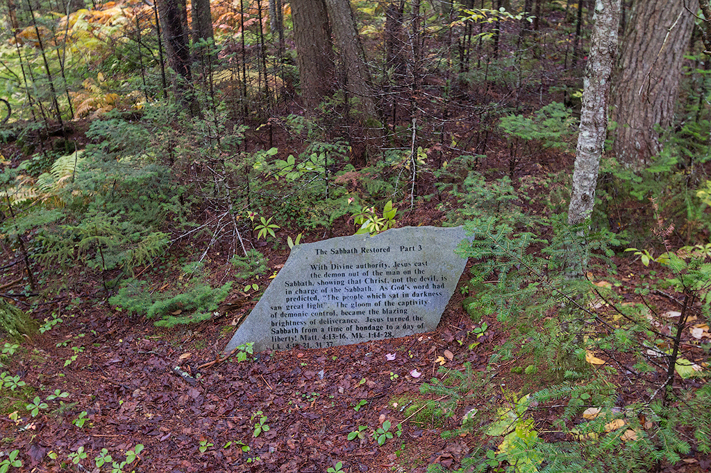

12. Исцеление Христом женщины от сильной горячки в Субботу продемонстрировало, как высоко ценил Бог жизнь каждого человека. Чудо вселило в женщину радость, и она с удовольствием прислуживала Христу за столом. В другой День Субботний, когда Иисус шел через кукурузное поле, Он показал, что правильное соблюдение Субботы гарантирует обеспечение физических потребностей человека, а не ограничивает их, а спасение и исцеление людей имеет более высокий приоритет, чем запрет на работы в этот день. Иисус назвал Субботу днём Господним, заявив своё право судить о том, что является нарушением его правил, а что - нет. Святое Евангелие от Луки 4:38-44, Святое Евангелие от Матфея 12:1-8, Святое Евангелие от Марка 2:23-28
  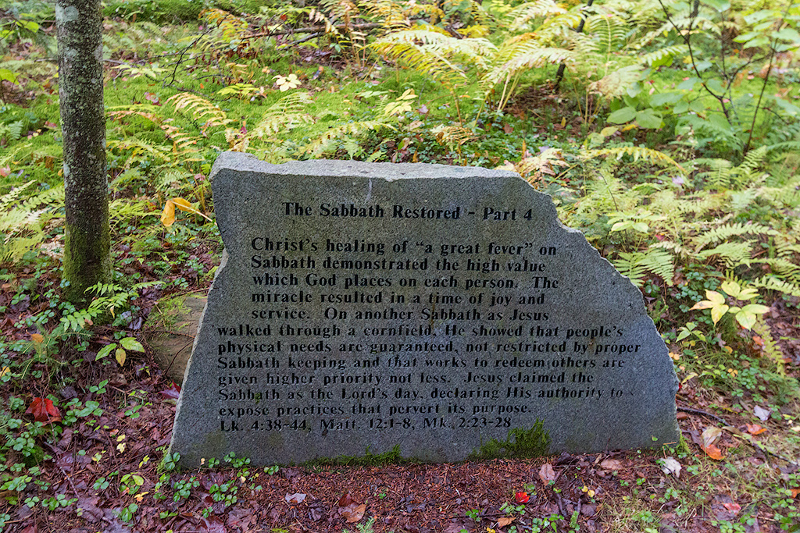

13. Когда в Субботу Иисус излечил человека с парализованной иссохшей рукой, Он тем самым восстановил человеческое достоинство всех людей. Человек – венец создания Господа; практически во всех отношениях стоит значительно выше животных по развитию. И, если в любой день делается всё возможное для лечения бессловесных животных, что же говорить о том, насколько больше заботы следует вкладывать в тех, кто сотворен по образу и подобию Господа! Спасать жизни, делать добро, помогать и сострадать – всё это и составляет суть Субботнего Дня. Святое Евангелие от Матфея 12:9-15, Бытие 1:26-31
  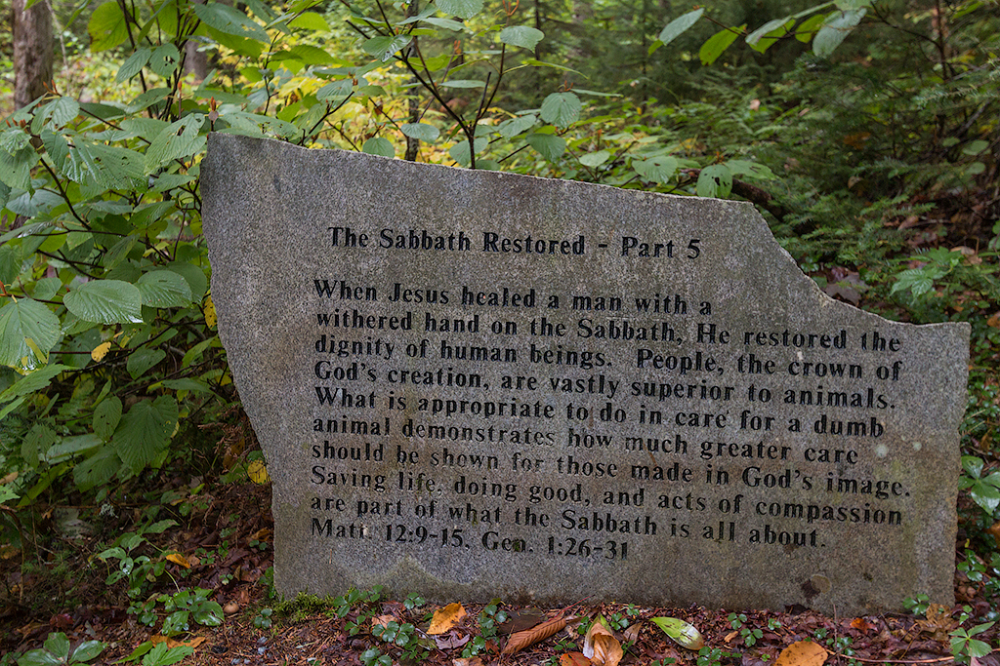

14. Иисус описал себя как Божественного, несущего свет Мессию. Потом Он наглядно доказал это и связал свои деяния с истинным соблюдением Субботы, подарив зрение человеку, «родившемуся слепым». Те, кто отвергали Христа, выбрали темноту и неверие. Для них Суббота стала пустой формой, лишенной всякого смысла. И напротив: Суббота принесла свет и жизнь исцелённому человеку, который верил, принял помощь, следовал за Христом и поклонялся Ему. Святое Евангелие от Иоанна 8-10
  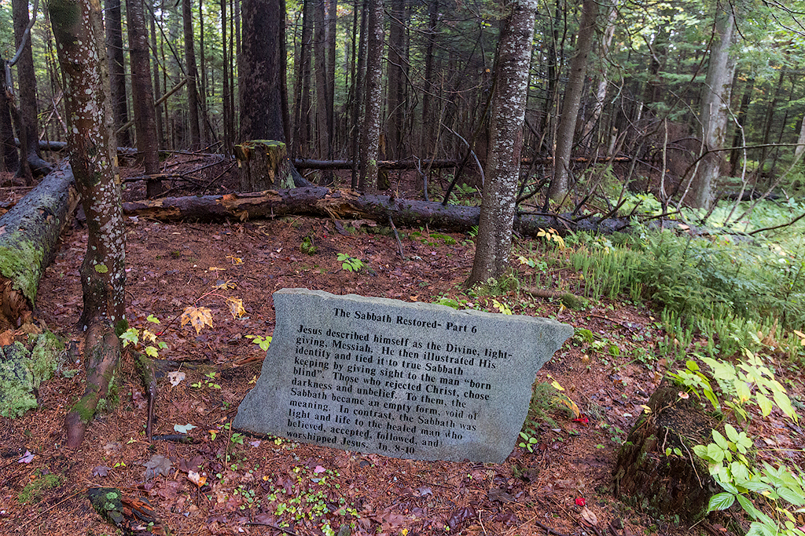

15. В двух своих последних чудесах в Субботу Христос изгнал сатану из жертв, исцелил и освободил их, чтобы они возносили хвалу и поклонялись Богу. Суббота была восстановлена, как время для познания Бога, приобщения к церковной жизни и принятия нашего Создателя всем сердцем. Иисус обвинялся в нарушении Субботы, но, в действительности, Он нарушал только те правила, которые извращали Субботу. Именно Он лучше всех соблюдал День отдохновения, вернув ему чистоту и красоту. Святое Евангелие от Луки 13:10-17, 14:1-6
  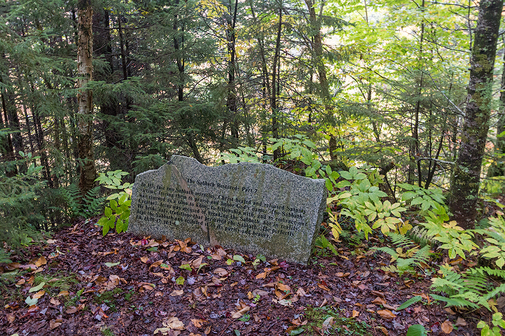

16. **На Кресте в День Субботний.**
  Вначале Бог отдыхал в Субботний День после того, как закончил свою созидательную работу. Адаму и Еве было позволено отдыхать вместе с Ним в тот День отдохновения, когда праздновалось завершение создания мира. И на кресте оказался Христос тоже в Субботу после того, как сделал всё для искупления грехов на земле. Сегодня, в День Субботний мы можем отдыхать, благодаря тому, что свою работу закончили и Создатель, и Тот, кто искупил грехи наши. Святое Евангелие от Марка 15:40 - 16:2, Святое Евангелие от Иоанна 19:29-42
  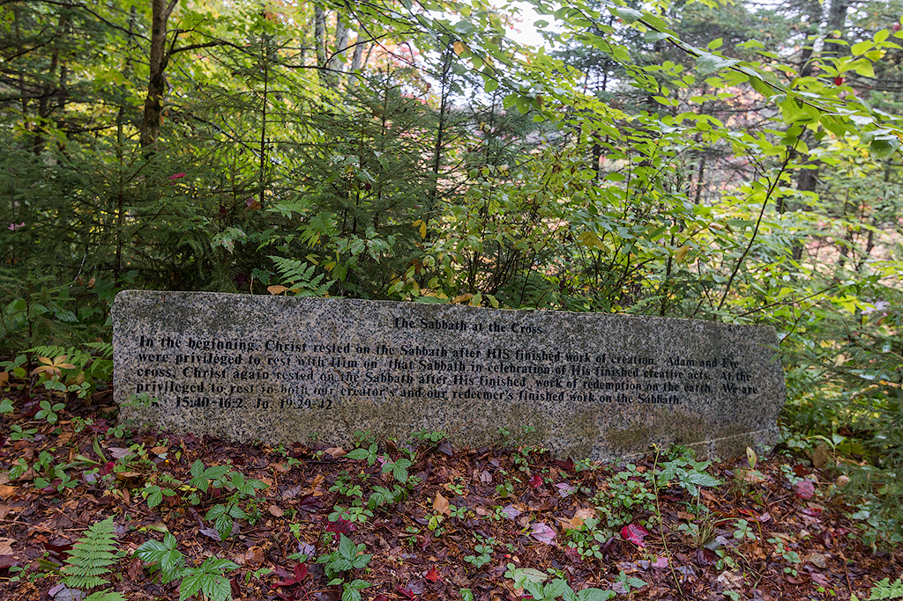

17. **День Субботний - от Распятия до приблизительно 50-го года нашей эры.**
  Существует ряд свидетельств о соблюдении Субботнего Дня верующими христианами в первом веке н.э. Самым ревностным его хранителем был Павел, который соблюдал Субботний День, где бы он ни оказался, - и в синагоге, и на берегу реки. Тогда этот день был посвящён молитвам, религиозным обрядам, поклонению, чтению Библии, её обсуждению и проповедованию о Христе. День отдохновения соблюдался всеми - и евреями, и христианами, а разногласия возникали только о личности Христа или о том, был ли Он Мессией. Святое Евангелие от Луки 23:56, Деяния св. Апостолов 13:14, 42, 44, 16:13-15, 17:1-5, 18:4
  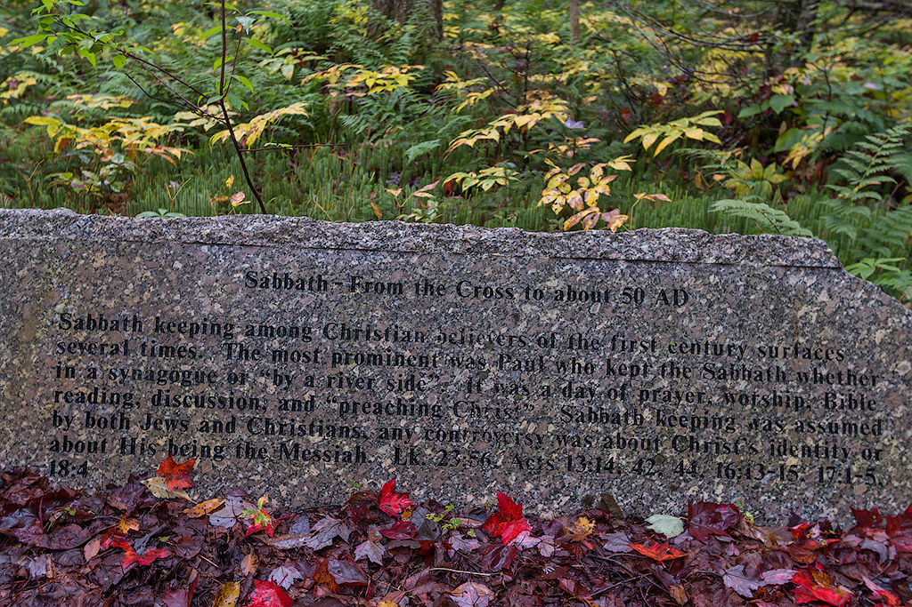

18. **Суббота - от 50г. до 100г. н.э.**
  В конце своей жизни Павел обращается к людям с просьбой: в Субботу оставить свои личные труды и с верой заняться богоугодными делами. День отдыха рассматривался, как признак религиозных убеждений, а также как намёк на вечное отдохновение на небесах. Сам Христос полагал, что Его последователи будут считать День отдыха священным 40 лет после распятия, но почитание этого дня сохранялось вплоть до конца первого века. Святое Евангелие от Матфея 24:20, Второе послание к Коринфянам 5:14-21, Послание к Евреям 3 и 4, Откровение Иоанна Богослова 1:10, Святое Евангелие от Марка 2:28
  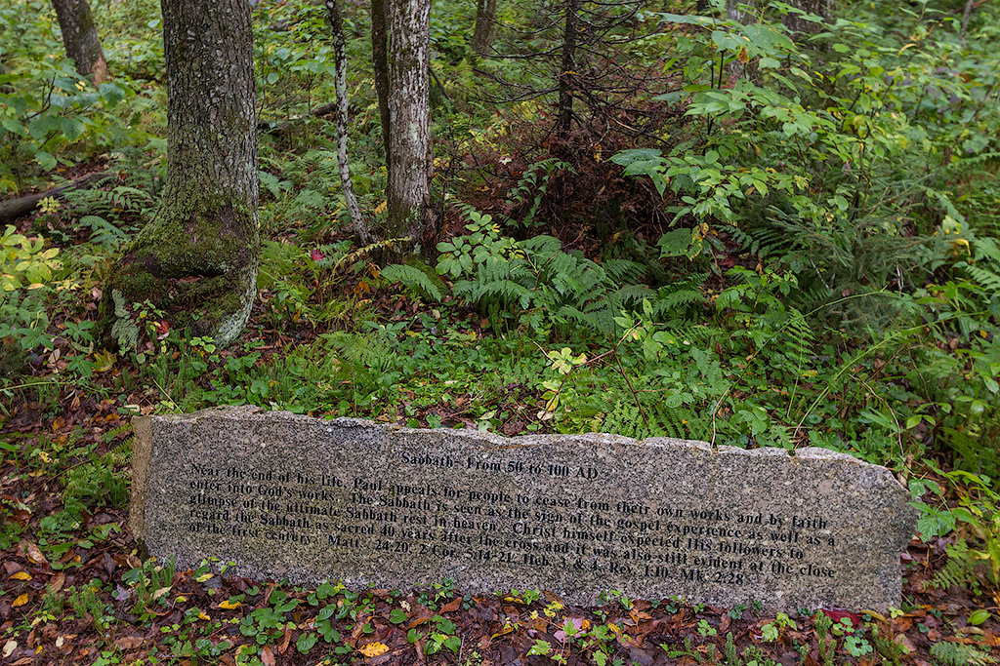

19. **Суббота - от 100г. до 300г. н.э**
  Последователи Христа хранили Субботу в течение следующих двух веков, но изменений избежать не удалось - они медленно появлялись. Ежегодно, день «первых плодов» (превратился в Пасху) отмечался в честь воскрешения Христа. Позже, еженедельные воскресные религиозное службы стали проводиться параллельно с Днём Субботним. Некоторые христиане того времени пытались дистанцироваться от иудаизма, а заодно и от соблюдения Субботы из-за социальных, политических, и военных гонений на евреев.--
  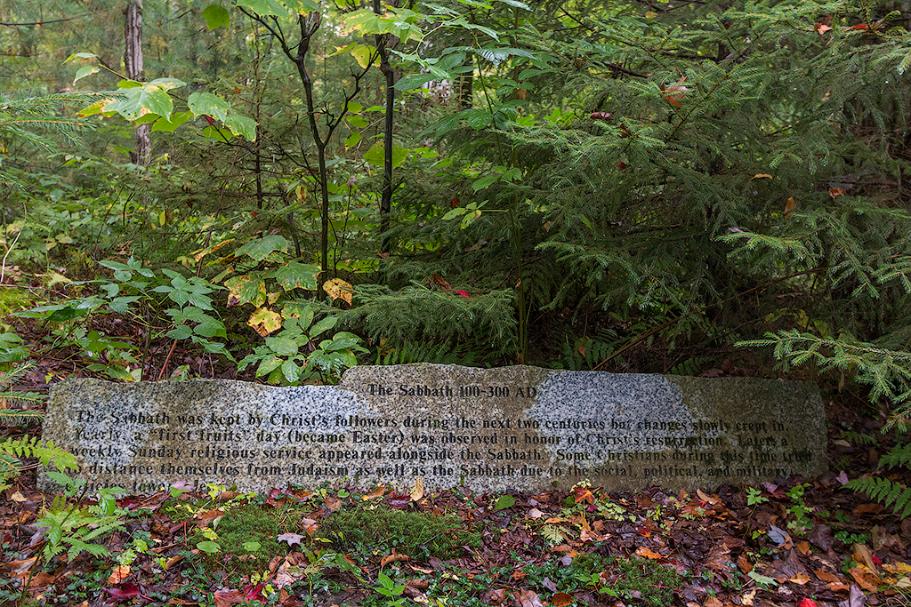

20. **Суббота - от 300г. до 500г. н.э.**
  В течение следующих двух веков большинство христиан соблюдало и субботний День, и воскресенье, как дни для отправления религиозных обрядов. Похоже, единственными исключениями были церкви в Риме и Александрии, так как к этому времени они прекратили соблюдение субботнего Дня переключились на воскресенье. Однако, и гражданские законы, и церковные советы того времени начали сдвигать субботний День отдохновения на рабочий день, оставля выходным днём только воскресенье в большей части христианского мира.
  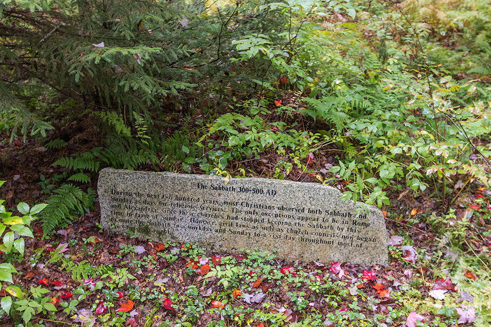
  Субботу постепенно стали считать пережитком иудаизма, который игнорировался и попирался в течение многих веков. Но в каждый период времени находились те, которые лелеяли веру в Христа, считая её единственной связью между Богом и человеком, те, которые считали Библию единственным правилом жизни, и те, которые свято чтили истинный День отдохновения, Субботу.
  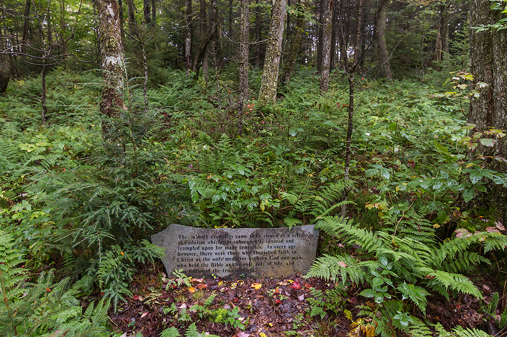

21. **Суббота на нелегальном положении - от 500г. до 1500г. н.э.**
  Более 1000 лет Суббота соблюдалась только отдельными людьми и некоторыми разрозненными группами верующих, «скрывавшимися в глуши». Но усилия вальденсов и других проповедников Библии принесли свои плоды во многих местах. В это время хранителей Дня субботнего можно было найти в Эфиопии, Гане, Армении, Франции, Италии, Норвегии, Богемии и России. Некоторых из этих верующих преследовали, находили и даже истязали за соблюдение святого Дня отдохновения. Откровение Иоанна Богослова 12:1-6, 13 и 14, 13:5-7
  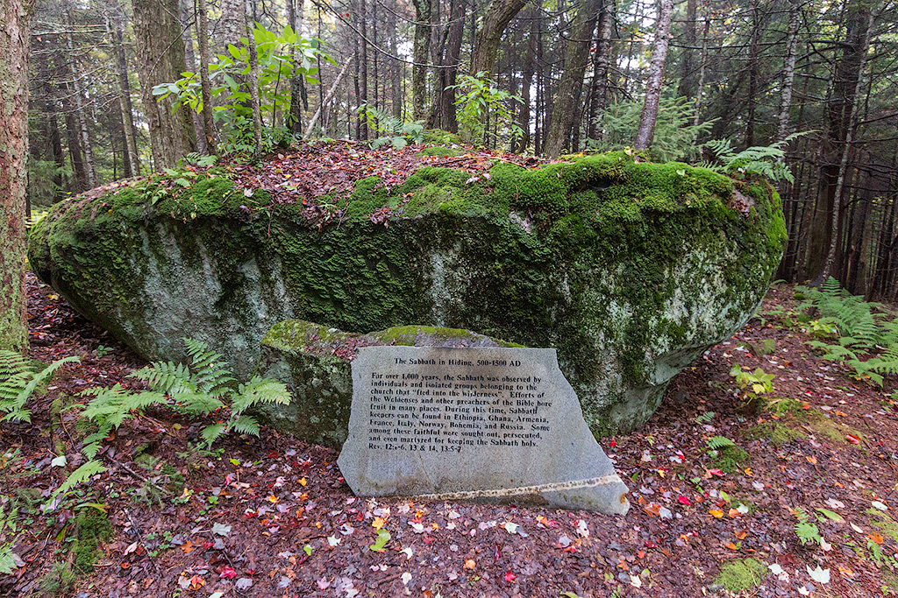

22. **Суббота – от 1500г. до 1600г.**
  В период Реформации громкий призыв «жить строго по Священному Писанию» привёл к широкому распространению преобразований и способствовал возрождению 7-го дня, как Дня отдохновения. Хранители Субботы воспряли духом во многих местах - в Моравии, Австрии, Испании, Норвегии, Финляндии, Швеции, Трансильвании и Англии. Особенно радовались анабаптисты, поддерживавшие День отдохновения, включая Константино Понсе Де ла Фуенте, Освальда Глэйта и Андреаса Фишера. Но многие не смогли пережить прежних гонений, которым они подвергались за отказ соответствовать канонам государственной церкви.
  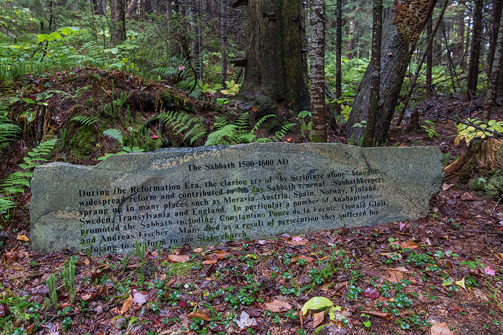

23. **Суббота - от 1600г. до 1700г.**
  В 17 веке День отдохновения широко распространился. Отчасти это было реакцией на преследования, но в основном, конечно, благодаря возобновлению обращения к текстам Священного Писания. В Америке Сэмюэль и Тейси Хаббард начали соблюдать Субботний День отдохновения после внимательного изучения Библии. Вместе со Стивеном Мамфордом они открыли первую церковь Баптистов седьмого дня в Новом свете в г. Ньюпорте, шт. Род-Айленд в 1671 году.
  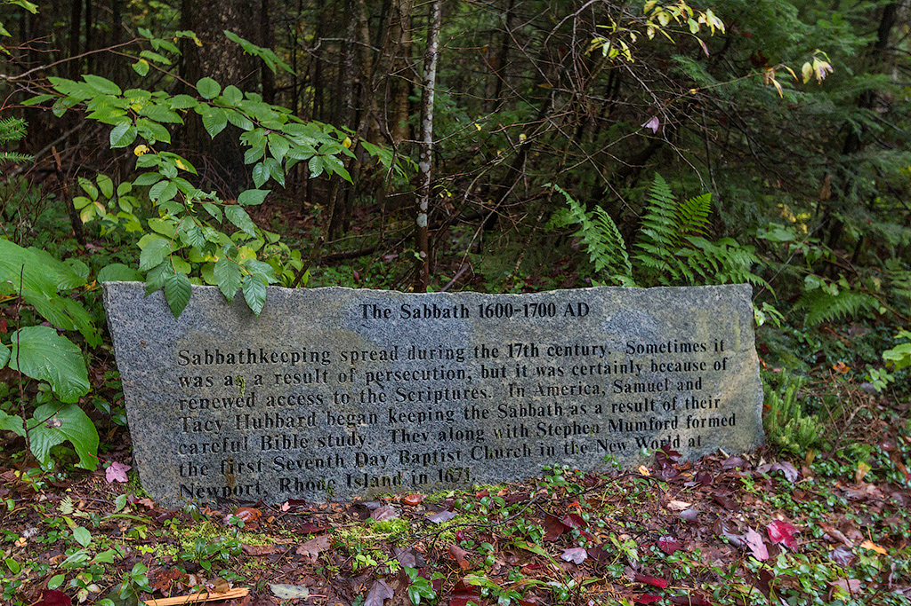

24. **Субботний День отдохновения в Америке - от 1700г. до 1800г.**
  К сожалению, хранители Субботы страдали от предубеждений и несправедливого отношения к ним других христиан в Новом свете, как, впрочем, и в Старом. Их штрафовали и бросали в тюрьмы только за их убеждения. Несмотря на это, к началу 1800-х церковь Баптистов седьмого дня имела 12 приходов в пяти штатах и насчитывала более 1000 членов. Именно из тех первых центров Субботний День распространился с потоком мигрантов на запад.
  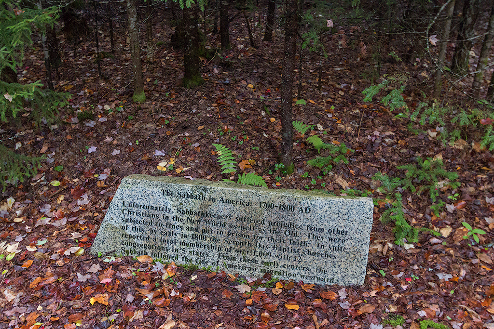

25. **Соблюдение Субботы в Америке: 1800 - 1844.**
  В начале 19-го века хранители субботнего Дня отдохновения в Новом свете объединились и стали официальное именовать свою организацию «Баптисты седьмого дня». К 1843 году число членов организации возросло до 6 000, а церквей насчитывалось уже 60. Для распространения правды о Дне Субботнем баптисты предпринимали согласованные действия: организовывали миссионерские общества и публиковали журналы. Один из миссионеров - Рейчел Оукс - рассказала о Дне отдохновения Фредерику Уилеру - пастору адвентистстов - миллеритов в Вашингтоне, шт. Нью-Гэмпшир, и тот вместе с семьей Фарнсворт начал соблюдать Субботний день в 1844 году.
  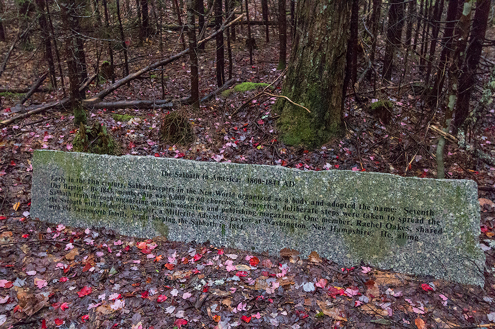

26. **Суббота в 1844 – 1848 гг.**
  По прошествии девятнадцати веков День субботний стали снова связывать со Вторым Пришествием Иисуса. В течение последовавших нескольких лет эта связь укрепилась, расширилась и усилилась. Джозеф Бейтс стал главным приверженцем сторонником соблюдения Дня отдыха среди адвентистов, но к нему скоро присоединились Джеймс и Елена Уайт, Хирэм Эдсон, Стивен Пирс и другие. Все они считали, что Субботний День напрямую связан с «печатью Бога», Ковчегом завета Господнего и божественным святилищем, вестями трёх ангелов и «начертанием образа зверя». Откровение Иоанна Богослова 7, 11 и 14.
  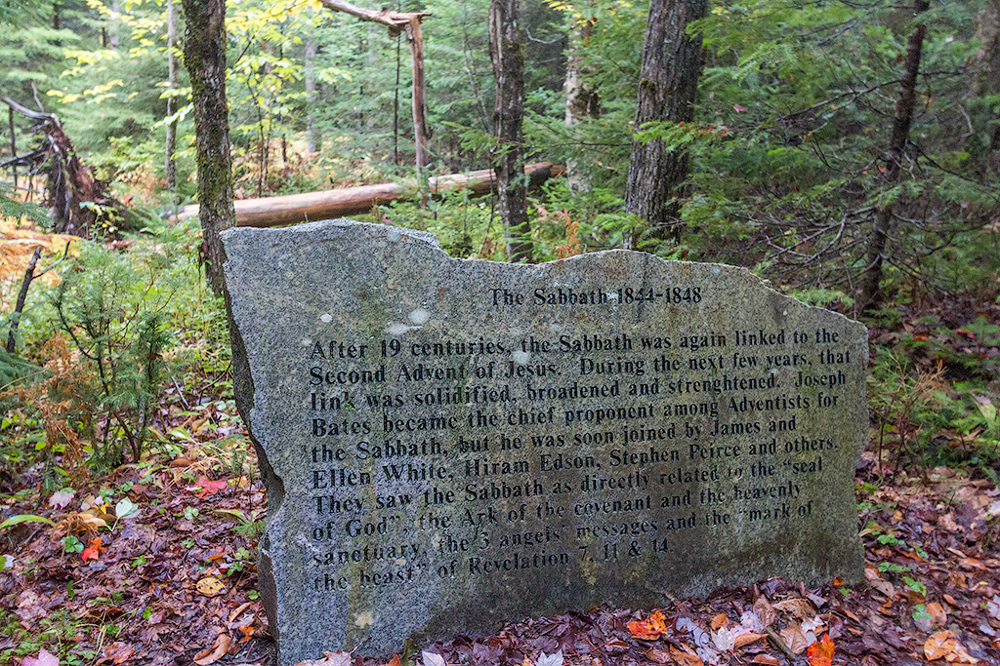

27. **Суббота в 1848 – 1863 гг.**
  Адвентистское движение оказалось рассеяно и разъединено после Великого разочарования 1844 года. День отдыха стал катализатором «настоящей правды», необходимым для воссоединения адвентистов в единую, связанную семью. В 1848 году в северо-восточных областях страны были проведены семь конференций, касавшихся Дня отдыха; они-то и сплотили верующих, сформировали их единую позицию относительно понимания ряда доктрин, среди которых были «Суббота» и «Пришествие Христа». Эти две главные доктрины и легли в основание названия «Адвентисты седьмого дня», выбранного этой группой верующих для самоидентификации, когда они объединились в 1863 году.
  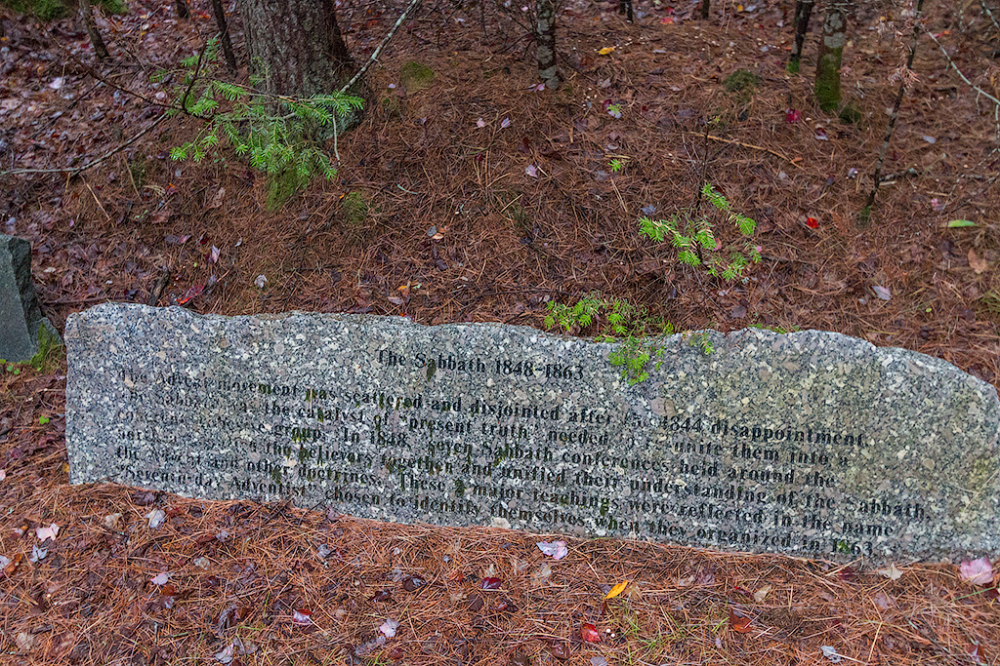

28. **Субботний день: от создания организации до 1998 г.**
  Бог хранил Субботу в течение 6 000 лет. Сначала этот день был дан человечеству через Адама и Еву, затем доверен Израилю, восстановлен Христом, потом его придерживались апостолы, соблюдали многие верующие и, наконец, он был принят Адвентистами седьмого дня всего мира. В настоящее время насчитывается более 10 миллионов христиан, соблюдающих День Субботний в 205 странах по всему земному шару.
  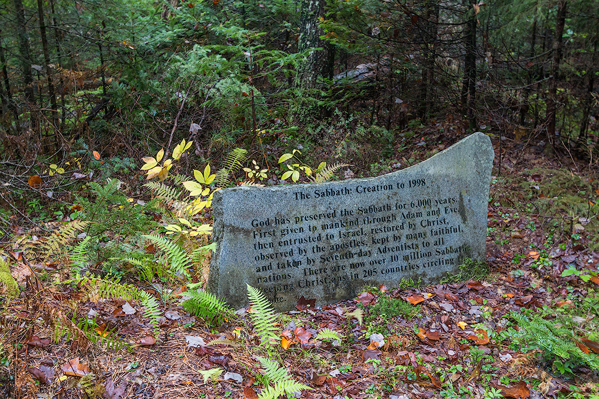

29. **Суббота в ближайшем будущем.**
  Как и в прошлом, опять грядёт переломный момент относительно соблюдения Дня отдохновения. В Главе 14 Откровений Иоанна Богослова время перед Пришествием Христа описывается, как страшный хаос. Вечный вопрос о выборе пути предстоит решить для себя каждому человеку: как будет он относиться к Иисусу Христу, к побуждениям Святого Духа, к поклонению Богу и верности Ему? И, поскольку для этого заключительного отрезка времени вопросы сформулированы, подлинность отношения каждого человека к спасительной работе Христа проявится сама собой, а увидеть её можно будет в контексте соблюдения Дня Субботнего. Даниил 2, 7-9, Откровение Иоанна Богослова 12-14
  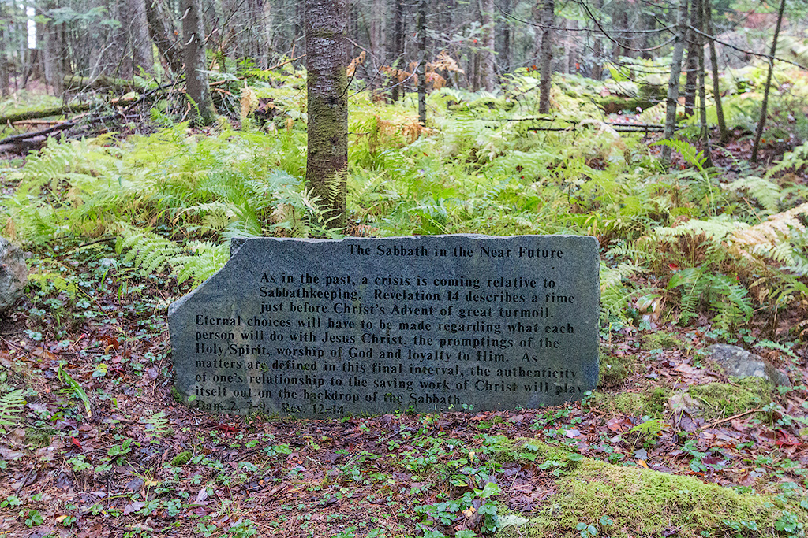

30. **Суббота во время Пришествия.**
  День отдохновения ... – это время для поклонения нашему Создателю и Избавителю; время, когда Бог освобождает и исцеляет нас; время, чтобы с верой отдыхать в построенном Им мире; время ощущать нашу бесконечную ценность в глазах Господа; время познавать, общаться и наслаждаться нашим Создателем наедине с Ним, время любить всем сердцем того, кто умер, чтобы мы могли жить, ликуя, когда широко разверзнутся могилы «и мертвые во Христе воскреснут прежде» и мы «вместе с ними восхищены будем на облаках в сретение Господу на воздухе, и так всегда с Господом будем», испытывая полный отдых в День отдохновения. Первое послание к Фессалоникийцам 4:13-18
  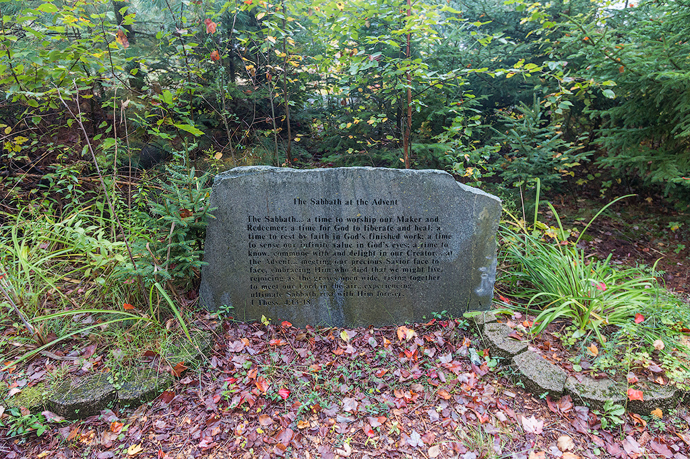

31. **Суббота в Новой Земле.**
  «Итак постараемся войти в покой оный...» и «мы, по обетованию Его, ожидаем нового неба и новой земли, на которых обитает правда». И это должно случиться, «тогда из месяца в месяц и из субботы в субботу будет приходить всякая плоть пред лице Мое на поклонение, говорит Господь.» Послание к Евреям 4:11, Второе послание Петра 3:13, Исаия 66:23
  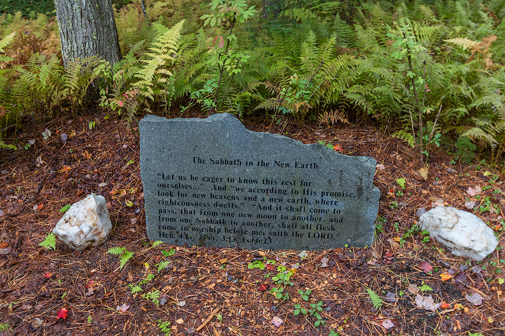

---

**Оригинал** - [http://www.detailshere.com/sabbathtrail.htm](http://www.detailshere.com/sabbathtrail.htm)

**Перевод** - Раксана Гумбатова

**Фотографии** - Николай Логвиненко. Лицензия [CC BY-NC-SA 4.0 ](https://creativecommons.org/licenses/by-nc-sa/4.0/)  

---

[Другие языки](../)

